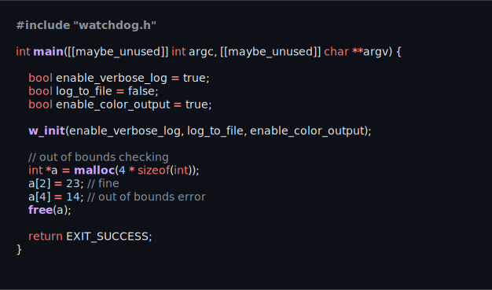
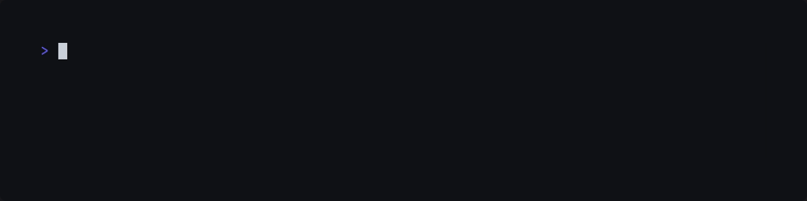

<div align="center">
<h1>
 Watchdog
</h1>
</div>

<div align="center">
<p>
  <a href="https://github.com/ragibasif/watchdog">
    
  </a>
  <a href="https://github.com/ragibasif/watchdog/pulse">
    
  </a>
  <a href="https://github.com/ragibasif/watchdog/stargazers">
    
  </a>
  <a href="https://github.com/ragibasif/watchdog/network/members">
    
  </a>
  <a href="https://github.com/ragibasif/watchdog/actions">
    
  </a>
  <a href="https://visitorbadge.io/status?path=https%3A%2F%2Fgithub.com%2Fragibasif%2Fwatchdog">
    
  </a>
  <a href="https://github.com/ragibasif/watchdog/issues">
    
  </a>
  <a href="https://github.com/ragibasif/watchdog/blob/master/LICENSE">
    
  </a>
</p>
</div>

Watchdog wraps dynamic memory functions (`malloc`, `calloc`, `realloc`, `free`) and
tracks all memory activity at runtime:

- Memory Leak Detection
- Buffer Overflows / Out-of-Bounds Access
- Double Free Detection
- Thread Safe
- Verbose Logging with Optional File Output
- Minimal Integration – Just One Header and One C File


## Usage

### Installation

Include `watchdog.h` and `watchdog.c` in your project.


Then `#include watchdog.h` in a source/header file and pass flag `-DWATCHDOG` to
the CFLAGS of your build system to enable the debugger.


The following line is an example of a possible build instruction. The project
requires at least C11 to be used as intended.

```sh
gcc -std=c11 -DWATCHDOG -lpthread main.c watchdog.c -o program
```

### Defaults

Verbose logging is on by default, log to file is off by default, and color
output is off by default.


To customize the defaults, pass appropriate boolean to `w_init`.


Enabling `log_to_file` will direct log output to a log file named `watchdog.log`.
Color output is turned off if `log_to_file` is enabled regardless of the
`enable_color_output` variable value.

If `enable_verbose_log` is set to false, only errors will be logged.

### Malloc


### Realloc


### Calloc


### Free


### Out of Bounds Checking





Disclaimer: **For educational and recreational purposes only.**
