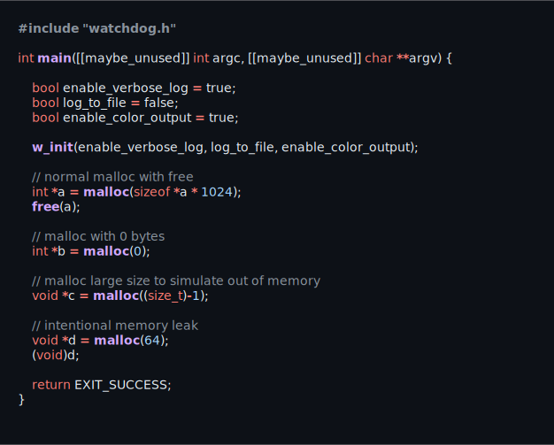
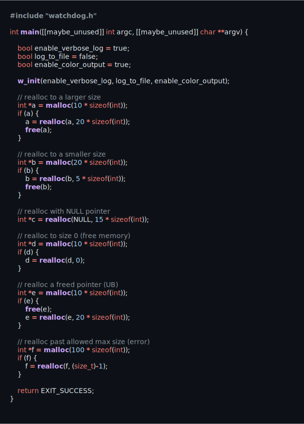
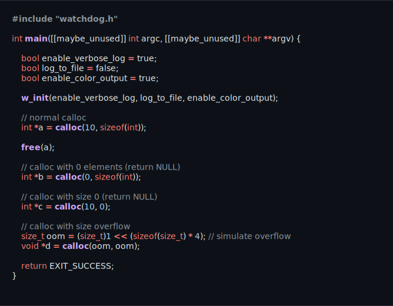
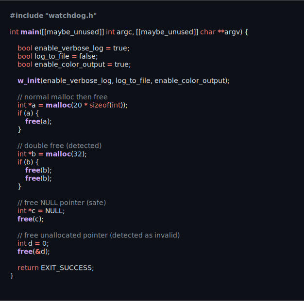

<h1>
 Watchdog
</h1>

  
  
  
  
  
  
  
  

Watchdog is a minimal dynamic memory debugger for tracking allocations,
reallocations, and frees. It can detect detect common memory bugs and
vulnerabilities such as leaks, out of bounds errors, and double free errors.

## Malloc

## Realloc

## Calloc

## Free

Disclaimer: **For educational and recreational purposes only.**
