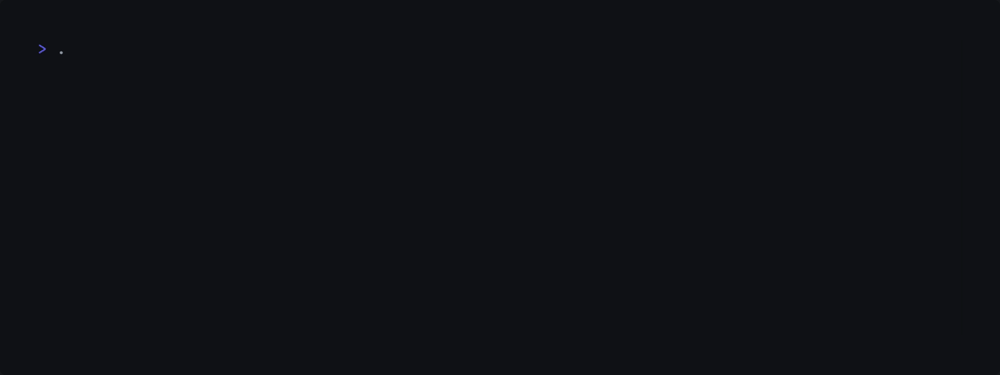

<div align="center">
<h1>
 Watchdog
</h1>
</div>

<div align="center">
<p>
  <a href="https://github.com/ragibasif/watchdog" target="_blank" rel="noopener noreferrer">
    
  </a>
  <a href="https://github.com/ragibasif/watchdog/pulse" target="_blank" rel="noopener noreferrer">
    
  </a>
  <a href="https://github.com/ragibasif/watchdog/stargazers" target="_blank" rel="noopener noreferrer">
    
  </a>
  <a href="https://github.com/ragibasif/watchdog/network/members" target="_blank" rel="noopener noreferrer">
    
  </a>
  <a href="https://visitorbadge.io/status?path=https%3A%2F%2Fgithub.com%2Fragibasif%2Fwatchdog" target="_blank" rel="noopener noreferrer">
    
  </a>
  <a href="https://github.com/ragibasif/watchdog/issues" target="_blank" rel="noopener noreferrer">
    
  </a>
  <a href="https://github.com/ragibasif/watchdog/blob/master/LICENSE" target="_blank" rel="noopener noreferrer">
    
  </a>
</p>
</div>

---

<a href="mailto:ragibasif@tuta.io">
  
</a>
<a href="https://www.linkedin.com/in/ragibasif/" target="_blank" rel="noopener noreferrer">
  
</a>
<a href="https://github.com/ragibasif" target="_blank" rel="noopener noreferrer">
  
</a>
<a href="https://www.youtube.com/@ragib_asif" target="_blank" rel="noopener noreferrer">
  
</a>

Watchdog is a lightweight, thread-safe memory allocation tracker for C projects. It detects **memory leaks**, **buffer overflows** (via canaries), and **invalid/double frees** with zero external dependencies.

<a href="https://www.youtube.com/watch?v=juKcJpgxBVk" target="_blank" rel="noopener noreferrer">YouTube - Stop Memory Leaks In C With Watchdog</a>

## Features

- **Leak Detection**: Reports any memory not freed before program exit.
- **Overflow Protection**: Uses a 64-byte canary buffer to detect out-of-bounds writes.
- **Double Free Prevention**: Tracks allocation states to catch redundant `free()` calls.
- **Thread Safe**: Uses POSIX mutexes to handle multi-threaded allocations.
- **Automated Verification**: Includes a Dockerized test suite and CI/CD pipeline.

## Project Structure

```text
watchdog/
├── watchdog.c          # Core implementation (Dynamic Array logic)
├── watchdog.h          # API Macros (Redefines malloc/free)
├── Makefile            # Build system
├── Dockerfile          # Standardized test environment
├── tests/
│   ├── test.c          # Simulates memory bugs
│   └── test_runner.py  # Automated validation script
└── .github/workflows/  # GitHub Actions (CI)
```

## Quick Start

Watchdog wraps dynamic memory functions (`malloc`, `calloc`, `realloc`, `free`) and
tracks all memory activity at runtime.

```c
#define WATCHDOG_ENABLE
#include "watchdog.h"

#include <stdio.h>
#include <stdlib.h>

int main([[maybe_unused]] int argc, [[maybe_unused]] char **argv) {

    bool enable_verbose_log  = true;
    bool log_to_file         = false;
    bool enable_color_output = true;

    w_init(enable_verbose_log, log_to_file, enable_color_output);

    int *buffer = malloc(sizeof *buffer * 1024);
    free(buffer);

    return EXIT_SUCCESS;
}
```


## Usage

### Installation

Include `watchdog.h` and `watchdog.c` in your project.

Then `#include watchdog.h` in a source/header file and pass flag `-DWATCHDOG_ENABLE` to
the CFLAGS of your build system to enable the debugger or add `#define WATCHDOG_ENABLE`
to a file.

### Defaults

Verbose logging is on by default, log to file is off by default, and color
output is off by default.

```c
static bool verbose_log  = true;
static bool log_to_file  = false;
static bool color_output = false;
```

To customize the defaults, pass appropriate boolean to `w_init`.

```c
bool enable_verbose_log  = true;
bool log_to_file         = false;
bool enable_color_output = true;

w_init(enable_verbose_log, log_to_file, enable_color_output);
```

Enabling `log_to_file` will direct log output to a log file named `watchdog.log`.
Color output is turned off if `log_to_file` is enabled regardless of the
`enable_color_output` variable value.

If `enable_verbose_log` is set to false, only errors will be logged.

### Building

The included `Makefile` handles the compilation of the library and the test suite:

```bash
make
```

## Running Tests

You can run the automated suite locally or via Docker:

```bash
python3 tests/test_runner.py
```

Docker (Clean Environment):

```bash
docker build -t watchdog-tester .
docker run --rm watchdog-tester
```

## Examples

Code samples are located in a dedicated `examples/` folder.

### Malloc

```c
void malloc_example(void) {

    size_t count  = 5;
    int   *buffer = malloc(sizeof *buffer * 5);
    for (size_t i = 0; i < count; i++) {
        buffer[i] = -(i - count) * count;
    }
    for (size_t i = 0; i < count; i++) {
        printf("%d ", buffer[i]);
    }

    putchar('\n');
    free(buffer);
    buffer = NULL;
}
```


### Realloc

```c
void realloc_example(void) {
    short *buffer = malloc(34222);
    buffer        = realloc(buffer, 2342);
    buffer        = realloc(buffer, 2342342);
    buffer        = realloc(buffer, 2);
    buffer        = realloc(buffer, 10);
    buffer        = realloc(buffer, 0);
    free(buffer);
    buffer = NULL;
}
```



### Calloc

```c
void calloc_example(void) {
    // Demonstrates correct usage of calloc
    size_t count  = 5;
    int   *buffer = calloc(count, sizeof *buffer);
    for (size_t i = 0; i < count; i++) {
        printf("%d ", buffer[i]); // should output 0
    }
    putchar('\n');
    free(buffer);
    buffer = NULL;
}
```


### Free

```c
void free_example(void) {
    // Demonstrates correct usage of free
    size_t         count   = 5;
    short int     *buffer0 = malloc(sizeof *buffer0 * count);
    unsigned char *buffer1 = calloc(count, sizeof *buffer1);
    long double   *buffer2 = realloc(buffer2, sizeof *buffer2 * count);
    free(buffer1);
    buffer1 = NULL;
    free(buffer2);
    buffer2 = NULL;
    free(buffer0);
    buffer1 = NULL;
}
```


### Leak Check

```c
void leak_example(void) {
    unsigned long long int *buffer = malloc(sizeof *buffer * 20);
    // intentionally not calling free
    // watchdog will detect this and report it
}
```


### Overflow Check

```c
void overflow_example(void) {
    char *buffer = malloc(sizeof *buffer * 10);
    strcpy(buffer, "This will overflow"); // out-of-bounds write
    // of buffer overflows will be detected with using canary values
}
```


### Double Free Check

```c
void double_free_example(void) {
    char **buffer = malloc(sizeof *buffer * 20);
    free(buffer);
    free(buffer); // triggers a double-free error
}
```


### Invalid Free Check

```c
void invalid_free_example(void) {
    float *buffer;
    free(buffer); // will trigger an error since buffer wasn't allocated
}
```


## Contributing

Interested in contributing? Please see our [Contributing Guide](CONTRIBUTING.md) for guidelines on how to help improve Watchdog.

## License

This project is licensed under the [MIT License](LICENSE).

## FAQ

### Does Watchdog work in production builds?

No. It's intended for development/debug builds.

### Does it detect stack overflows?

No. It only monitors dynamic memory (heap).

### What systems does it support?

POSIX-compliant systems (Linux, macOS). Windows support is limited (for now).
