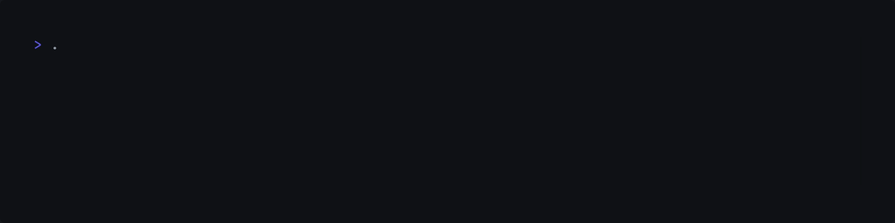

<div align="center">
<h1>
 Watchdog
</h1>
</div>

<div align="center">
<p>
  <a href="https://github.com/ragibasif/watchdog">
    
  </a>
  <a href="https://github.com/ragibasif/watchdog/pulse">
    
  </a>
  <a href="https://github.com/ragibasif/watchdog/stargazers">
    
  </a>
  <a href="https://github.com/ragibasif/watchdog/network/members">
    
  </a>
  <a href="https://github.com/ragibasif/watchdog/actions">
    
  </a>
  <a href="https://visitorbadge.io/status?path=https%3A%2F%2Fgithub.com%2Fragibasif%2Fwatchdog">
    
  </a>
  <a href="https://github.com/ragibasif/watchdog/issues">
    
  </a>
  <a href="https://github.com/ragibasif/watchdog/blob/master/LICENSE">
    
  </a>
</p>
</div>

Watchdog wraps dynamic memory functions (`malloc`, `calloc`, `realloc`, `free`) and
tracks all memory activity at runtime:

- Memory Leak Detection
- Buffer Overflows / Out-of-Bounds Access
- Double Free Detection
- Thread Safe
- Verbose Logging with Optional File Output
- Minimal Integration – Just One Header and One C File


## Usage

### Installation

Include `watchdog.h` and `watchdog.c` in your project.


Then `#include watchdog.h` in a source/header file and pass flag `-DWATCHDOG_ENABLE` to
the CFLAGS of your build system to enable the debugger or add `#define WATCHDOG_ENABLE`
to a file.


### Defaults

Verbose logging is on by default, log to file is off by default, and color
output is off by default.


To customize the defaults, pass appropriate boolean to `w_init`.


Enabling `log_to_file` will direct log output to a log file named `watchdog.log`.
Color output is turned off if `log_to_file` is enabled regardless of the
`enable_color_output` variable value.

If `enable_verbose_log` is set to false, only errors will be logged.

## Examples

### Malloc

```c
void malloc_example(void) {

    size_t count  = 5;
    int   *buffer = malloc(sizeof *buffer * 5);
    for (size_t i = 0; i < count; i++) {
        buffer[i] = -(i - count) * count;
    }
    for (size_t i = 0; i < count; i++) {
        printf("%d ", buffer[i]);
    }

    putchar('\n');
    free(buffer);
    buffer = NULL;
}
```


### Realloc

```c
void realloc_example(void) {
    short *buffer = malloc(34222);
    buffer        = realloc(buffer, 2342);
    buffer        = realloc(buffer, 2342342);
    buffer        = realloc(buffer, 2);
    buffer        = realloc(buffer, 10);
    buffer        = realloc(buffer, 0);
    free(buffer);
    buffer = NULL;
}
```


### Calloc

```c
void calloc_example(void) {
    // Demonstrates correct usage of calloc
    size_t count  = 5;
    int   *buffer = calloc(count, sizeof *buffer);
    for (size_t i = 0; i < count; i++) {
        printf("%d ", buffer[i]); // should output 0
    }
    putchar('\n');
    free(buffer);
    buffer = NULL;
}
```


### Free

```c
void free_example(void) {
    // Demonstrates correct usage of free
    size_t         count   = 5;
    short int     *buffer0 = malloc(sizeof *buffer0 * count);
    unsigned char *buffer1 = calloc(count, sizeof *buffer1);
    long double   *buffer2 = realloc(buffer2, sizeof *buffer2 * count);
    free(buffer1);
    buffer1 = NULL;
    free(buffer2);
    buffer2 = NULL;
    free(buffer0);
    buffer1 = NULL;
}
```



### Leak Check

```c
void leak_example(void) {
    unsigned long long int *buffer = malloc(sizeof *buffer * 20);
    // intentionally not calling free
    // watchdog will detect this and report it
}
```


### Overflow Check

```c
void overflow_example(void) {
    char *buffer = malloc(sizeof *buffer * 10);
    strcpy(buffer, "This will overflow"); // out-of-bounds write
    // of buffer overflows will be detected with using canary values
}
```


### Double Free Check

```c
void double_free_example(void) {
    double *buffer = malloc(sizeof *buffer * 20);
    free(buffer);
    free(buffer); // triggers a double-free error
}
```


### Invalid Free Check

```c
void invalid_free_example(void) {
    float *buffer;
    free(buffer); // will trigger an error since buffer wasn't allocated
}
```


